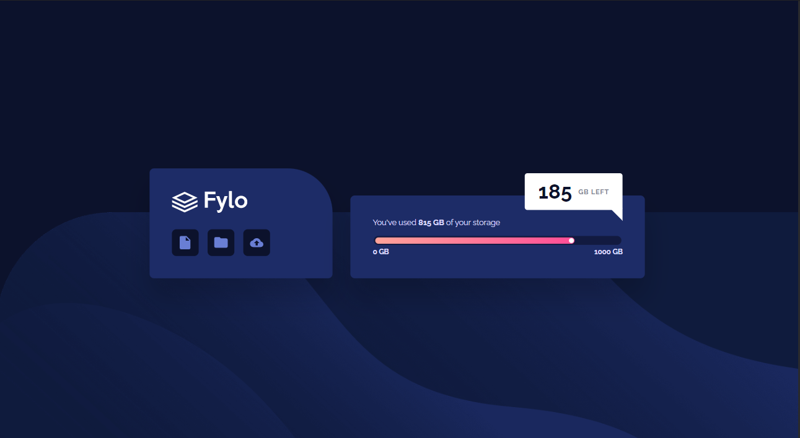

# Frontend Mentor - Fylo data storage component solution

This is a solution to the [Fylo data storage component challenge on Frontend Mentor](https://www.frontendmentor.io/challenges/fylo-data-storage-component-1dZPRbV5n).

## Table of contents

- [Overview](#overview)
  - [Challenge](#challenge)
  - [Screenshot](#screenshot)
  - [Links](#links)
- [My process](#my-process)
  - [Built with](#built-with)
  - [What I learned](#what-i-learned)
  - [Continued development](#continued-development)
- [Author](#author)

## Overview

### Challenge

Users should be able to:

- View the optimal layout for the site depending on their device's screen size.

### Screenshot

### Links

- Solution URL: [See the code on GitHub](https://github.com/KristinaRadosavljevic/fylo-data-storage-component)
- Live Site URL: [View live site](https://fylo-data-storage-component-liard-one.vercel.app/)

## My process

### Built with

- Semantic HTML5 markup
- CSS/Sass
- Flexbox
- CSS grid
- Animations
- Media queries

### What I learned

This challenge gave me a chance to practice animations (especially using the `transform` property) and absolute positioning of elements within each other, including the use of psedo-elements such as `::after`.

### Continued development

Pseudo-elements and transformations are a rich source of inspiration when it comes to implementing animations in a project, so in a future challenge I would like to push mysefl even further to get more practice in this area.

## Author

- LinkedIn - [Kristina Radosavljevic](https://www.linkedin.com/in/radosavljevic-kristina/)
- GitHub - [KristinaRadosavljevic](https://github.com/KristinaRadosavljevic)
- Frontend Mentor - [@KristinaRadosavljevic](https://www.frontendmentor.io/profile/KristinaRadosavljevic)
